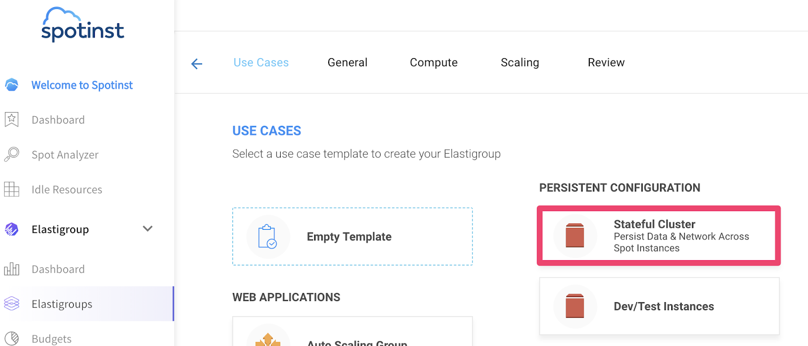
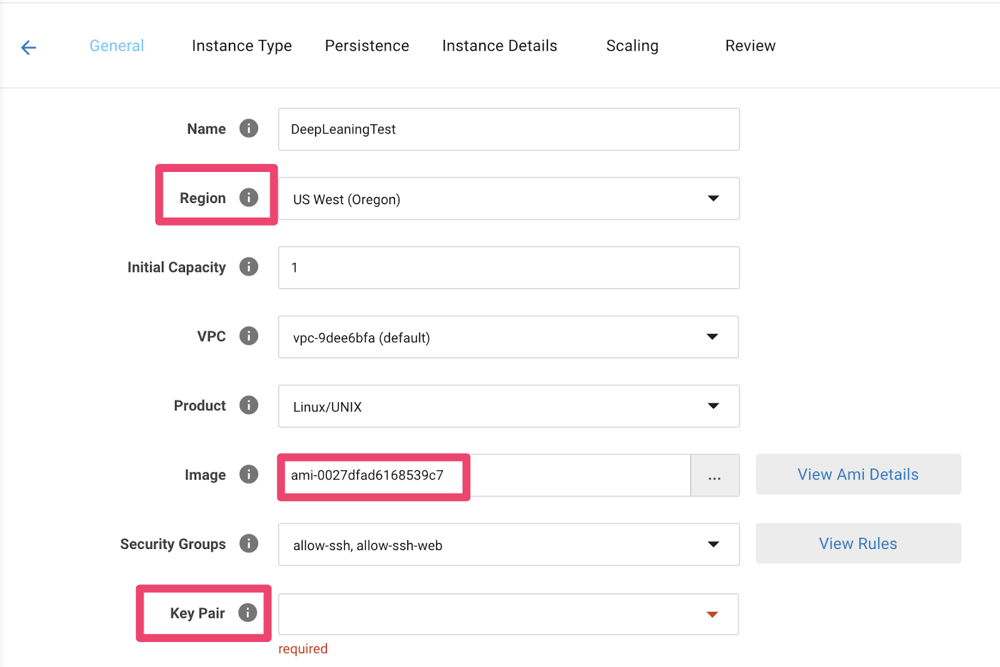

# Run MNIST CNN over aws spot instance using spotinst 
## Train deep learning modules on ec2 cloud platform:
In order to develop and train deep learning NN models over cloud platforms you don't need much, you simply start your OD instance with your favorite GPU\CPU platform and aws custom ml ami, clone your code to the server and start running. 
BUT training NN takes hours or even days depending on the complexity of the network and the dataset size and aws gpu servers are not that cheap as on demand instances (consistent servers)

## So what is the solution ?
Use spot instances of course. Spot instances uses AWS spare capacity and could be purchased with significant discount - up to 80% discount.
for the full pricing list: https://aws.amazon.com/ec2/spot/instance-advisor/

Training NN over spot instances instead of on demand instances: 
Cons:
* The main issue of using spot instances while training your NN is the persistency issue, since aws gave us the server with significant discount they can interrupt it as well with just a short notice, Therefore, it’s not recommended for time-sensitive workloads.
* Instance termination can cause data loss if the training progress is not saved properly. 
* Persistency spot instances loses their data and infrastructure structure on interruption. 

## Training NN over spot instances: Principles 
* `Decouple compute, storage and code` This enables easy recovery and training state restore when an instance is terminated and replaced.
* `Use a dedicated volume for datasets, training progress (checkpoints) and logs` This volume should be persistent and not be affected by instance termination.
* `Use a version control system` (e.g. Git) for training code. 
* `Minimize code changes to the training script` This ensures that the training script can be developed independently and backup and snapshot operations are performed outside of the training code.

## Let's start developing:
#### Prerequisites:
* Active  spotinst account connected to AWS. https://api.spotinst.com/getting-started-with-elastigroup/
* Github repository with your training code.

#### Starting with the infrastructure:
Go to your spotinst account and start new `stateful` group:
`Stateful` is spotinst product that keeps on persistence for data volumes and root volumes.
In our case we will persist only the data volume, since we will not make any special changes for our OS.



* Start configuring your Elastigroup
When configuring your `stateful elastigroup` you should pay attention to the following fields:
    * Region: in case you want to use GPUs you should pay attention to the region, not all AWS regions support gpu.
https://docs.aws.amazon.com/dlami/latest/devguide/gpu.html

    * Image: ami-0027dfad6168539c7 is an Amazon machine image with pre-installed deep learning frameworks. 
    * Key-pair: in order to connect to the instance via SSH key pair must be configured


* Choose your market: recommended Instance type: g2.2xlarge (Basic gpu instance type)

* As discussed before we should maintain data persistency in order to prevent unnecessary data loss on interruption.
`Reattach policy` will guarantee that the same EBS volume will be reattached to the new spot instance when interruption occurs.

* Configure user data as follows: [userdata](https://github.com/essale/mnist-ec2-spot/blob/master/userdata/data_persistency_userdata.sh)

* new instance will be created without volumes we need to create and attach the volumes only for the first time. Let spotinst automate the rest of the process for you.

```
aws ec2 create-volume \
    --size 100 \
    --region <AWS_REGION> \
    --availability-zone <INSTANCE_AZ> \
    --volume-type gp2

aws ec2 attach-volume \
    --volume-id vol-<your_volume_id> \
    --instance-id i-<your_instance_id> \
    --device /dev/xvdb
```

Now you should see your instance connected with the volume (SSH to your machine and validate that the instance has been mounted the volume correctly)

    
`Deep learning example:`
Our example represent mnist dataset using convolutional neural networks.
The MNIST dataset is an image dataset of handwritten digits. It has 60,000 training images and 10,000 test images, each of which are grayscale 28 x 28 sized images.
 

Here we will mainly focus on the code infrastructure. As we saw before using deep learning on spot instances could not run out of the box. Some code formatting should be done before the code can run.
The full training script can be found here: [training script](https://github.com/essale/mnist-ec2-spot/blob/master/scripts/train_network.py)

## Prepare the environment:
When using keras over AWS first we need to use the conda ENV, for doing so we need to add the following script to our userdata.
```
sudo -H -u ubuntu bash -c "source /home/ubuntu/anaconda3/bin/activate tensorflow_p27; python train_network.py "
```

## Using checkpoints and callbacks
When Using deep learning over spot instances, in order to keep on persistent training without any data loss we should maintain continues checkpoints and callbacks.

* Checkpoints capture the exact value of all parameters used by a model. Checkpoints do not contain any description of the computation defined by the model and thus are typically only useful when source code that will use the saved parameter values is available. Checkpoints are using for continues training of your NN, we will use check points in our projects to avoid data loss on interruptions.

* Callbacks are set of functions to be applied at given stages of the training procedure. You can use callbacks to get a view on internal states and statistics of the model during training.

```
model.fit(x_train, y_train,
              batch_size=batch_size,
              epochs=epochs,
              initial_epoch=epoch_number,
              verbose=1,
              validation_data=(x_test, y_test),
              callbacks=callbacks) # 


# Model checkpoint callback
if not os.path.isdir(checkpoint_path):
    os.makedirs(checkpoint_path)
filepath = os.path.join(checkpoint_path, checkpoint_names)
checkpoint_callback = ModelCheckpoint(filepath=filepath,
                                      save_weights_only=False,
                                      monitor='val_loss')

```


#### Prerequisites:
* Active  spotinst account connected to AWS. https://api.spotinst.com/getting-started-with-elastigroup/
* Github repository with your training code.


